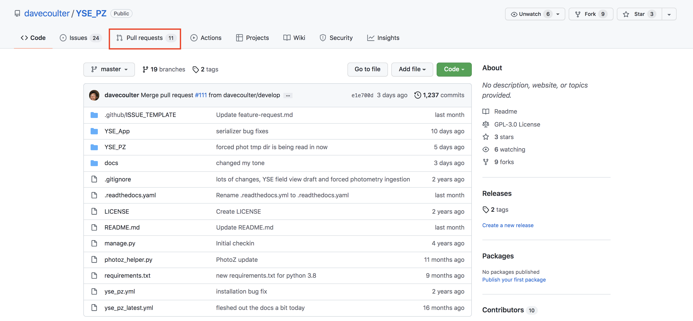
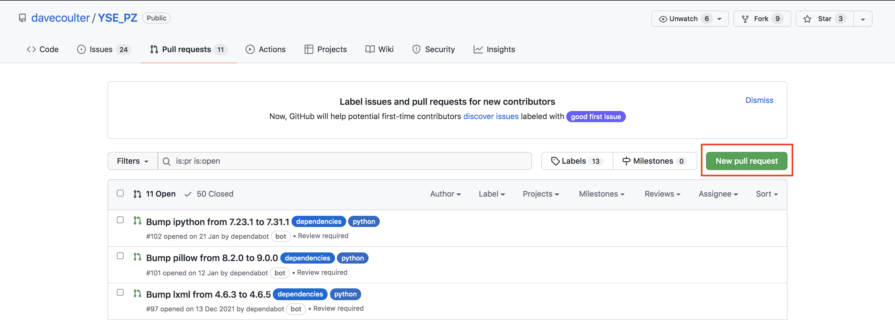
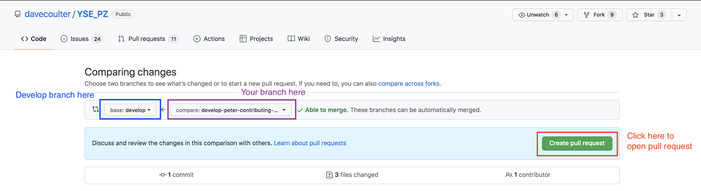
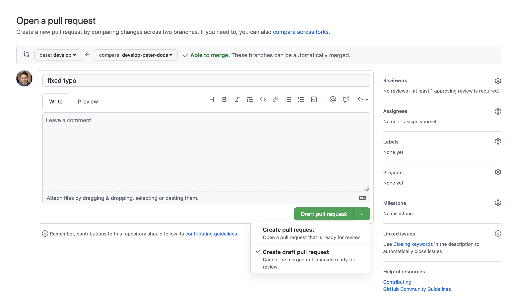
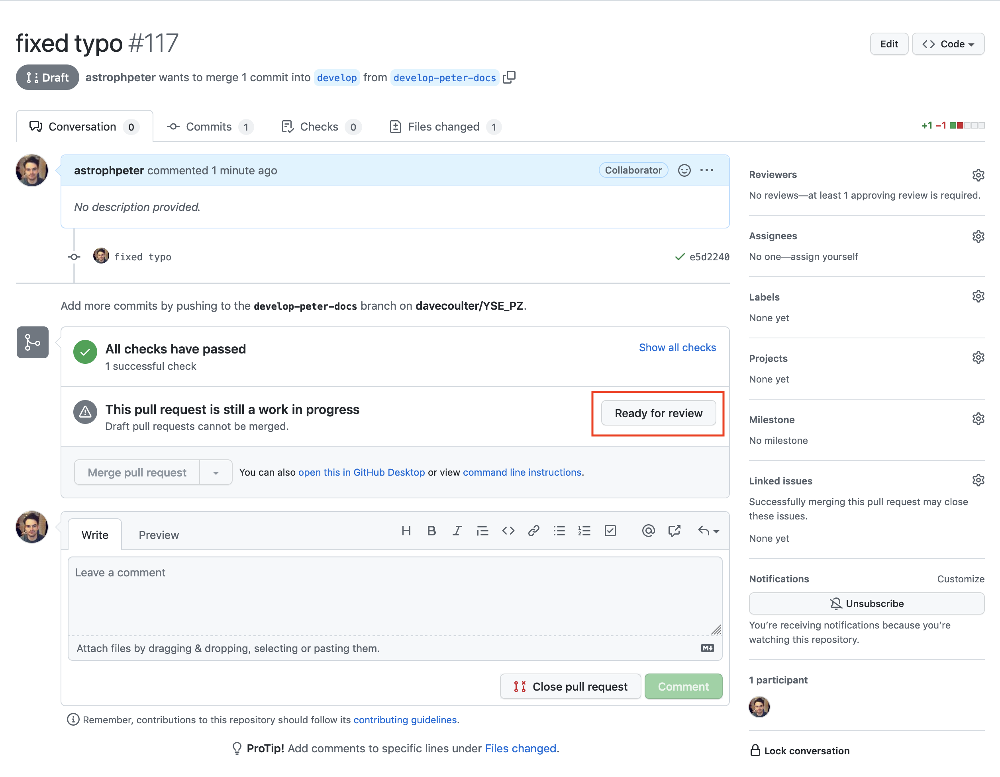

Contributing
************

This page walks you through how to contribute to the development of YSE_PZ.

We want your help. No, really. There may be a little voice inside your head that
is telling you that you're not ready to be an open source contributor; that your
skills aren't nearly good enough to contribute. What could you possibly offer a
project like this one?

We assure you - the little voice in your head is wrong. If you can write code or
documentation, you can contribute code to open source. Contributing to open
source projects is a fantastic way to advance one's coding and open source
workflow skills. Writing perfect code isn't the measure of a good developer
(that would disqualify all of us!); it's trying to create something, making
mistakes, and learning from those mistakes. That's how we all improve, and we
are happy to help others learn.

Being an open source contributor doesn't just mean writing code, either. You can
help out by writing documentation, tests, or even giving feedback about the
project (and yes - that includes giving feedback about the contribution
process). Some of these contributions may be the most valuable to the project
as a whole, because you're coming to the project with fresh eyes, so you can
see the errors and assumptions that seasoned contributors have glossed over.

.. note::
    This text was originally written by Adrienne Lowe for a PyCon talk,
    and was adapted by YSE_PZ based on its use in the README file for the MetPy
    project and `Astropy <https://www.astropy.org>`_ project.

General workflow
----------------

The normal develop workflow of YSE_PZ is to branch off develop, commit and push
changes, and then merge to the develop branch with a pull request. Finally, after
the pull request has been approved and your changes have been merged you can delete
your branch.

Starting from scratch, the typical development workflow would be the following.
Clone the YSE_PZ git repository

.. code:: none

    git clone https://github.com/davecoulter/YSE_PZ.git

Once in the YSE_PZ directory, checkout the develop branch.

.. code:: none

    git checkout develop

Create your own branch with the following naming convention.

.. code:: none

    git checkout -b develop-<your first name>-<one or two word description of what you are doing>

For example, if you were called Joe and wanted to contribute to documentation on
YSE_PZ your branch might be called develop-joe-docs. Then set the remote of your
new branch to github.

.. code:: none

    git push --set-upstream origin <your branch name>

This means you can push changes to github where they can be saved before you
are ready for a pull request. Now you can make your changes and additions to the
code and push changes to github.

Next go to to the YSE_PZ github repository page and go to the pull requests tab.

Then open a new draft pull request.

Create a pull request with your branch and develop.

Fill in the title and describe what you are trying to do in the description, and
open a draft pull request.

As you commit and push changes to your branch on github they will show up
in the draft pull request. When you are a happy for you changes to be reviewed
and then eventually merged into develop, click ready for review.

Your code will now be reviewed and when it is accepted it will be merged into
develop. After your branch has been merged, delete the branch from your local
repository.

.. code:: none

    git branch -d <your branch name>

Then delete the branch from Github.

.. code:: none

    git push -d origin <your branch name>

