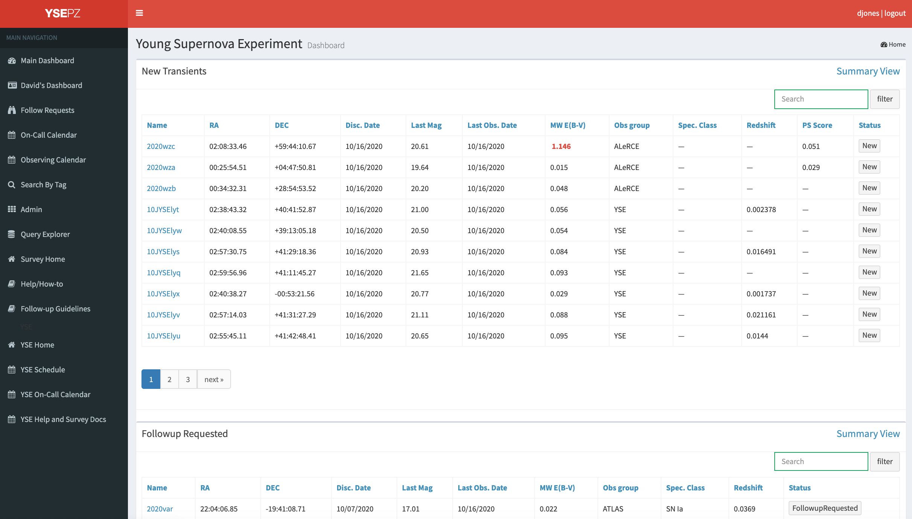
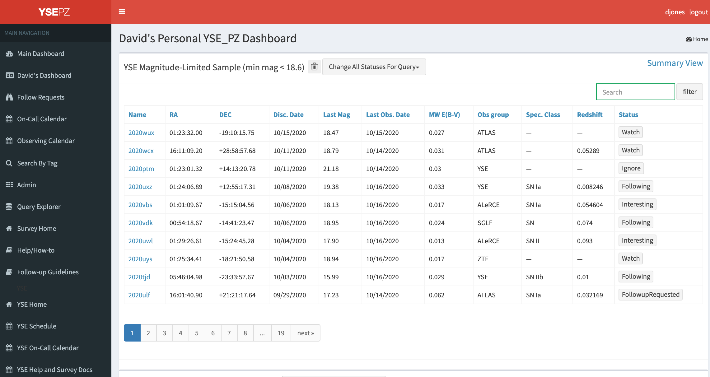

***************
Dashboard Pages
***************

Main Dashboard
==============

The :code:`YSE-PZ` home page is the dashboard, which sorts transients
into categories based on their "status".  Status labels are customizable
through the </admin> pages but the dashboard is hard-coded to show
transients with specific statuses New, Watch, Interesting, FollowupRequested, Following,
FollowupFinished, and NeedsTemplate.  Each category has a link to the transient "summary"
page for each object type and the transient names themselves link to the "detail"
page for a given SN.  Tables are sortable.

Personal Dashboard
==================

The </personaldashboard> page is in the same format as the main dashboard but
it is populated by queries selected by a given user.  The goal is to allow each user to
flag transients that meet their particular science interests.  See queries documentation
for more information about building queries and adding them to your dashboard.

