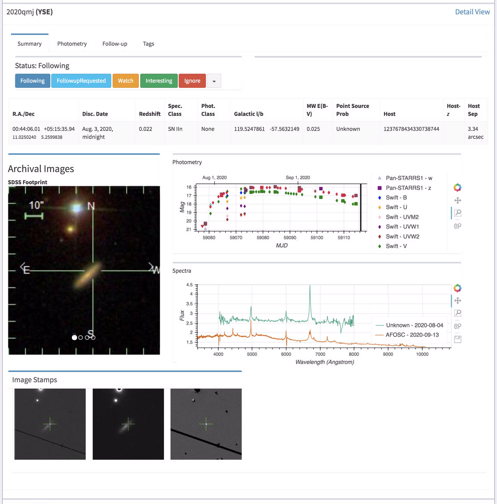
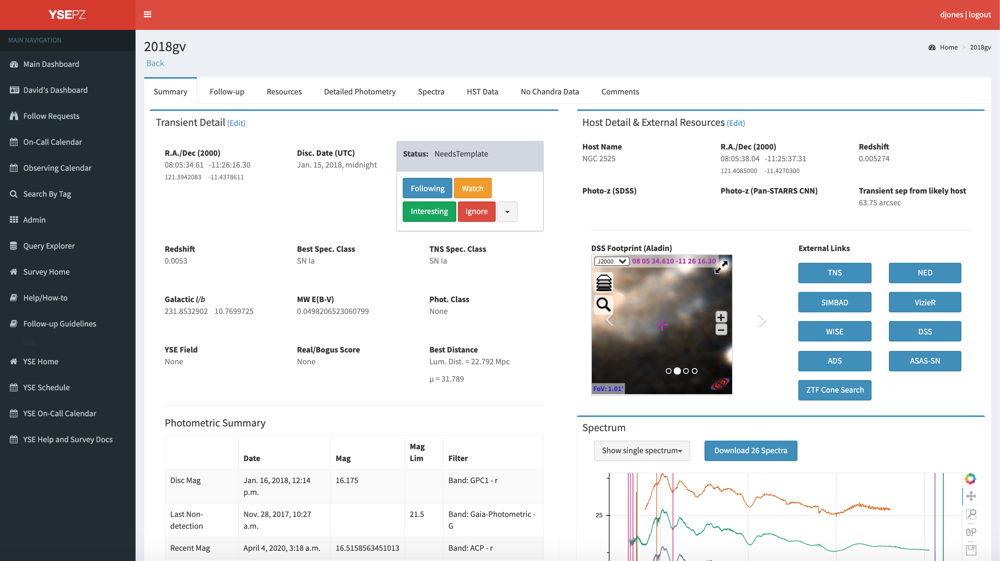
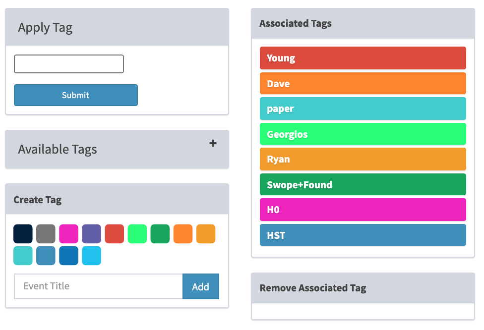
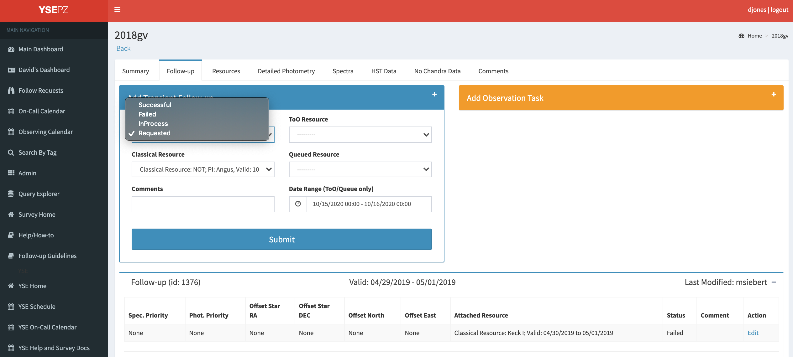
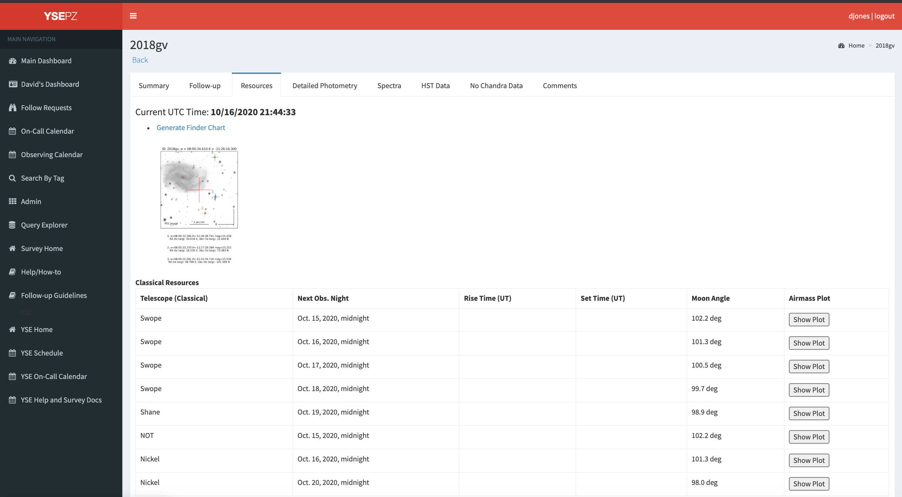
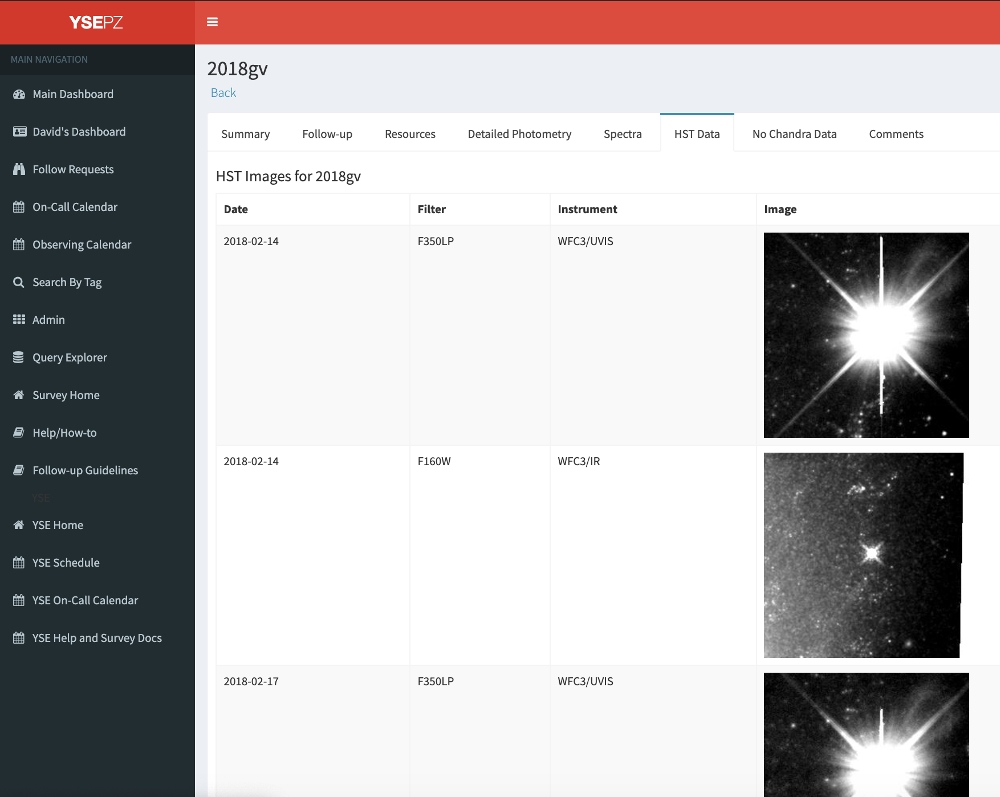

.. _detail:

************
Detail Pages
************

The transient summary and detail pages are intended to
provide in-depth metadata, photometry, spectroscopy, archival data,
observing tools, and tagging and commenting functionality.

Transient Summary View
======================

The transient summary view shows an abbreviated summary of each
transient matching a given status or query.  Summary links are
given at the upper right of each dashboard query table and can
also be accessed with a url directly, `<http://127.0.0.1:8000/transient_summary/status_or_query_title>`_.
The summary pages show 10 transients at a time, with pagination adding
more transients as the user scrolls (eventually the page bogs down because
the pagination isn't very smart).  Users can sort the summary views according
to the fields at the top of the page.

For each transient, the summary view displays statuses, the archival images of the
transient location, photometry, spectra, stamp images when they exist, and
a brief set of metadata at the top of the page.  The other tabs are not
currently functional.

Transient Detail View
=====================

Summary Tab
-----------
The summary tab includes metadata including transient coordinates,
discovery date, status, and SN type, among other fields.  Host
galaxy name, coordinates, and photometric redshift are also included
though host galaxy matching could be improved.  External links on
the right-hand side direct to the TNS page, Simbad, other archival results,
and ZTF data through a `MARS <https://mars.lco.global/>`_ cone search.

Interactive plots of photometry and spectra using Bokeh allow the
user to view any data that exist.  For unclassified SNe or SNe Ia,
the "Show SALT2 Fit" button uses sncosmo on the backend with very
approximate filter curves to estimate the SALT2 parameters including
shape, color, and time of maximum light.  Buttons allow downloading
photometry and a gzipped spectra file, with the "Download All Data"
button providing a JSON dictionary with every associated piece of
data in the database for a given transient.  Spectra can also be
uploaded directly to YSE-PZ through the web form.

On the bottom right, the "Tags" area allows users to apply tags
that identify a transient with a certain label.  Querying on tags
later can be done either through the `Search by tags <http://127.0.0.1:8000/transient_tags/>`_ link on the left-hand
side or by writing a query and adding it to a user's personal
dashboard (see :ref:`queries`).

Follow-up Tab
-------------

The Follow-up tab exists so that users can request a follow-up observation
on a given transient by selection a classical, queued, or ToO resource
that exists in the database.  For classical resources, these requests
will show up on the associated observing night page for the resource (see
observing night documentation).  Forms also allow users to add new Classical
or Followup resources, though some associated data such as adding principal
investigators and new instruments/telescopes can only be done through the
`<http://127.0.0.1:8000/admin/>`_ pages currently.

Resources Tab
-------------

The resources tab lists upcoming observing resources, allows users to
generate finder charts with offset stars, and shows the rise times,
set times, and moon angle for each transient on each available
observing resource.  Users can also plot the airmass of the transient
on a given resource as a function of time.

HST/Chandra Tabs
----------------

For transients with archival HST or Chandra data at the transient
location, YSE-PZ will display those data and allow FITS images to
be downloaded.

Comments Tab
------------

The comments tab allows conversations about each transient.  The UI
is not very refined, but using the @username syntax will email a given
user that their name has been mentioned in connection with this transient.
