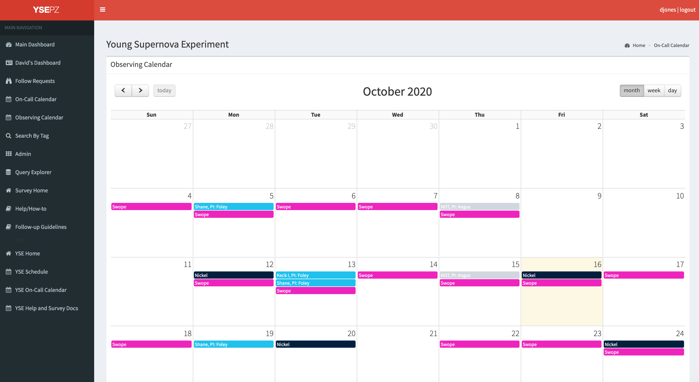
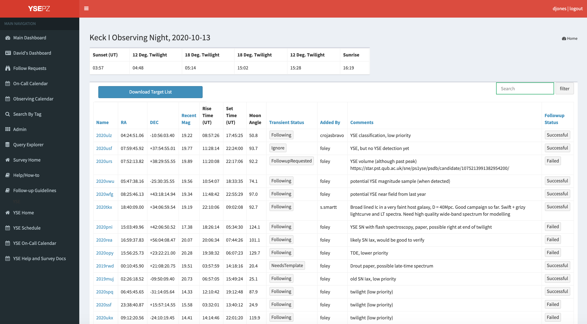

***************
Observing Pages
***************

The observing calendar page `<http://127.0.0.1:8000/observing_calendar/>`_ shows each
upcoming observing night that has been recorded in YSE-PZ:

By clicking on a given observing night, users can see the list of targets
that have been requested for a given night, including comments
on why an observation was requested, and the status of the request
(Requesting, InProcess, or Failed).  The target list can be
downloaded, nominally in Lick Observatory/Shane format, and
basic details about the observing night are shown.

Observing requests themselves can be made through the transient
detail pages.
