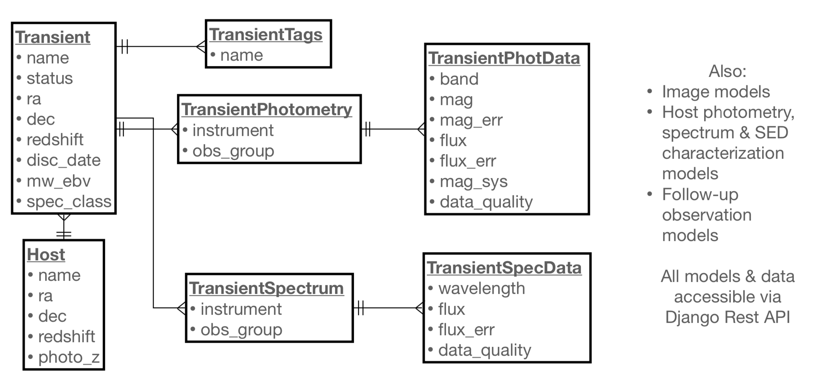

.. _queries:

****************************
Querying the YSE_PZ Database
****************************

This is a quick overview for running queries against the YSE-PZ database.

Running Queries with SQL Explorer
=================================

YSE-PZ uses `SQL Explorer <https://github.com/groveco/django-sql-explorer>`_
to allow users to query its database.  The link `<http://127.0.0.1:8000/explorer>`_ allows users to see queries
from other users and write their own (links assume the default URL for running the server locally).
Please see additional documentation through the :code:`SQL Explorer` link.

When writing a new query `<http://127.0.0.1:8000/explorer/new/>`_, the show schema button provides a way to view
each database table for YSE-PZ.  However, because the YSE-PZ model is complex,
and we summarize the most useful transient tables below.

The YSE-PZ Data Model
---------------------

The central table for transient data in YSE-PZ is the :code:`YSE_App_transient` table,
which in turn is connected to a :code:`tags` model, a :code:`Host` model, and :code:`TransientPhotometry` and
:code:`TransientSpectrum` models (photometry and spectrum models for host galaxies also exist).
These relationships are summarized below.  The :code:`TransientTags` model exists
such that YSE-PZ users can apply various tags to note attributes of objects that they are
interested in through the :ref:`detail`.

Writing Simple Database Queries
-------------------------------

A few example queries are provided below to demonstrate
the relationships between the various database tables.

Every spectroscopically classified SN Ia in the last 30 days::

  SELECT t.name
  FROM YSE_App_transient t
  WHERE t.TNS_spec_class = 'SN Ia' AND DATEDIFF(CURDATE(),t.disc_date) < 30

Every SN that has been tagged as :code:`Young`::

  SELECT t.name
  FROM YSE_App_transient t
  INNER JOIN YSE_App_transient_tags tt ON tt.transient_id = t.id
  INNER JOIN YSE_App_transienttag tg ON tg.id = tt.transienttag_id
  WHERE tg.name = 'Young'

Every SN where the most recent magnitude is brighter than 18::

  SELECT t.name, pd.mag
   FROM YSE_App_transient t, YSE_App_transientphotdata pd, YSE_App_transientphotometry p
   WHERE pd.photometry_id = p.id AND pd.mag < 18 AND
   pd.id = (
         SELECT pd2.id FROM YSE_App_transientphotdata pd2, YSE_App_transientphotometry p2
         WHERE pd2.photometry_id = p2.id AND p2.transient_id = t.id AND ISNULL(pd2.data_quality_id) = True
         ORDER BY pd2.obs_date DESC
         LIMIT 1
     )

Every SN within 40 kpc of a z < 0.01 host galaxy::

  SELECT t.name,
       t.ra AS transient_RA,
       t.`dec` AS transient_Dec,
       t.TNS_spec_class AS spec_class,
       t.redshift AS transient_z,
       h.ra AS host_RA,
       h.`dec` AS host_Dec,
       h.redshift AS host_z,
       DEGREES(ACOS(SIN(RADIANS(t.`dec`))*SIN(RADIANS(h.`dec`)) + COS(RADIANS(t.`dec`))*COS(RADIANS(h.`dec`))*COS(RADIANS(ABS(t.ra - h.ra)))))*3600 AS AngSepArcSec,
       (3e+5*COALESCE(t.redshift, h.redshift)/73) AS LuminosityDistanceMpc,
       (3e+5*COALESCE(t.redshift, h.redshift)/73)/POW((1.0 + COALESCE(t.redshift, h.redshift)), 2) AS AngularDiameterDistanceMpc,
       (ACOS(SIN(RADIANS(t.`dec`))*SIN(RADIANS(h.`dec`)) + COS(RADIANS(t.`dec`))*COS(RADIANS(h.`dec`))*COS(RADIANS(ABS(t.ra - h.ra))))*(3e+5*COALESCE(t.redshift, h.redshift)/73)/POW((1.0 + COALESCE(t.redshift, h.redshift)), 2)*1000) AS ProjectedDistKpc
  FROM YSE_App_transient t
  INNER JOIN YSE_App_host h ON h.id = t.host_id
  WHERE t.host_id IS NOT NULL
  AND (t.redshift
  OR h.redshift) IS NOT NULL
  AND COALESCE(t.redshift, h.redshift) > 0.028
  AND COALESCE(t.redshift, h.redshift) < 0.032
  AND t.TNS_spec_class = "SN Ia"
  AND (ACOS(SIN(RADIANS(t.`dec`))*SIN(RADIANS(h.`dec`)) + COS(RADIANS(t.`dec`))*COS(RADIANS(h.`dec`))*COS(RADIANS(ABS(t.ra - h.ra))))*(3e+5*COALESCE(t.redshift, h.redshift)/73)/POW((1.0 + COALESCE(t.redshift, h.redshift)), 2)*1000) < 40;

Writing Python-Based Queries on the YSE-PZ backend
==================================================
Occasionally, writing queries in raw SQL can be much more
difficult than using Django's python-SQL interface (especially
for Astronomers!).  For these cases, users familiar with django
can add tagged queries to the :code:`YSE_App/queries/yse_python_queries.py`
by writing a function using the :code:`@python_query_reg` decorator.
Each function should return a Django "queryset" object.  A brief example
of two of the queries above in Django/Python language is below.

Every spectroscopically classified SN Ia in the last 30 days::

  @python_query_reg
  def recent_spec_class():
      qs = Transient.objects.filter(Q(disc_date__gt=datetime.datetime.now()-datetime.timedelta(days=30)) &
                                    Q(TNS_spec_class='SN Ia'))
      return qs

Every SN that was brighter than 18th mag in the last week::

  from django.db.models import Count, Value, Max, Min, F # useful aggregation methods

  @python_query_reg
  def recent_bright_mag():

      qs = Transient.objects.filter(~Q(transientphotometry=None))
      qs = qs.filter(Q(transientphotometry__transientphotdata__mag__lt=18) &
	      Q(transientphotometry__transientphotdata__obs_date__gt=datetime.datetime.now()-datetime.timedelta(days=7)))

      qs2 = Transient.objects.filter(name__in=qs.values('name').distinct())

      return qs2

Adding Queries to a User's Personal Dashboard
=============================================
Queries can be added to a user's "Personal Dashboard" located
at the `<http://127.0.0.1:8000/personaldashboard>`_ link via the form at the bottom of
the page.  SQL queries created via the SQL Explorer can be selected
with the left-hand dropdown menu and Python-based queries can
be selected on the right-hand side (the title of the function is
the name of the query).  Queries can be removed via the trashcan
button next to each query.
