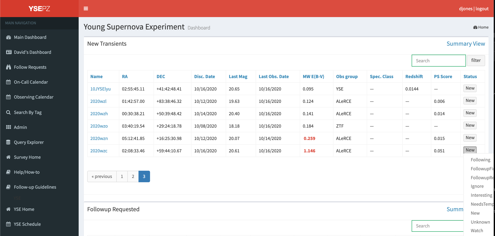

***********************************
Sorting and Flagging New Transients
***********************************

The primary purpose of YSE-PZ is to sort and follow new,
scientifically valuable transients.  There are many ways
to use the infrastructure described in the documentation
to do this, but here I describe a quick step-by-step guide
to the triaging method we use at UCSC.

Checking the Follow-up Lists
============================

Start by refreshing the dashboard page to ensure the latest transient
data are available.  Transients ingested from TNS or other sources, or
newly classified transients, are automatically sent to "New".
"FollowupRequested" is used for transients where a team member has
already requested an observation on a specific telescope.  The "Following"
list includes transients where our team has already obtained follow-up data.
The "Watch" list includes transients that may be interesting but no additional
observations have yet been requested.  The "Interesting" list is similar
to the "Watch" list but our team attempts to keep the list of "Interesting"
objects to a manageable size so that they can be monitored daily for
new developments.  FollowupFinished and NeedsTemplate are for older sources.

First, look at the new data in the following list to check for new
observations.  Sorting by last observing data and going to the last
page (or clicking the Last Obs. Date button twice to reverse sort)
will give the most recent observations.  Either the transient summary links
or the detail links for individual objects will bring up pages that show
any new data that exist.  Objects rising, those with interesting
classifications or spectra, or those that change their photometric
or spectroscopic behavior in some way, might be candidates for
additional follow-up observations.  These can be requested
through the Follow-up tab.

Checking the Watch List
=======================

Next, follow the same procedure for the Watch list.  If follow-up data
are desired, those can be requested through the Follow-up tab in the detail
pages.  If no follow-up observations will be requested by any team member,
we recommend moving the object to "Ignore" where it will no longer show up
on the dashboard but can still be found through SQL queries and
going to the detail page link directly.  Judgements on which transients
are of interest or not depend on individual science cases, but generically
unclassified, rising, bright transients are typically of particular interest
to our team.

Checking the New List
=====================

Finally, sort through the New list, which consists of objects that have likely
not been inspected by any team member.  Initially, sorting by "PS Score" or
point source score - this uses a catalog of Pan-STARRS sources that have gone
through a machine learning classification to determine if the source is extended
or not.  Sources with a high PS Score are likely variable stars, especially
if the reddening (MW E(B-V) column) is high.  Sources such as these can be
immediately moved to "Ignore", but note that there are still real SNe discovered
in galaxies with high PS scores.  Old SNe and SNe with high reddening are
also generally good candidates for moving to "Ignore".

Next, sort the New list by magnitude and inspect bright sources by opening the
detail pages.  The archival images of the field from SDSS and Pan-STARRS can
help by identifying if the transient is near a host galaxy; if not, it may
more likely be an orphan, asteroid, stellar outburst or some other artifact
that can be moved to ignore.  We often go down to sources with mag ~18.5
for these detailed inspections.  Sources near galaxies, even if they only
have a single detection, are usually moved to "Watch".  For members of a
certain group, sorting by "Obs Group" can also be helpful to inspect discoveries
of particular interest.

